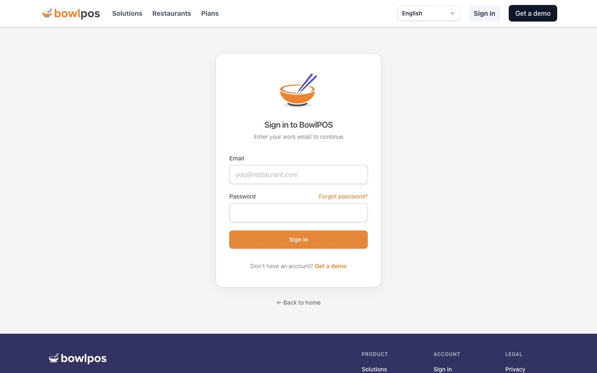
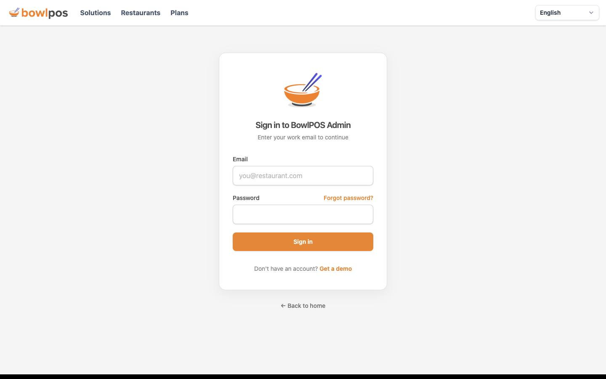
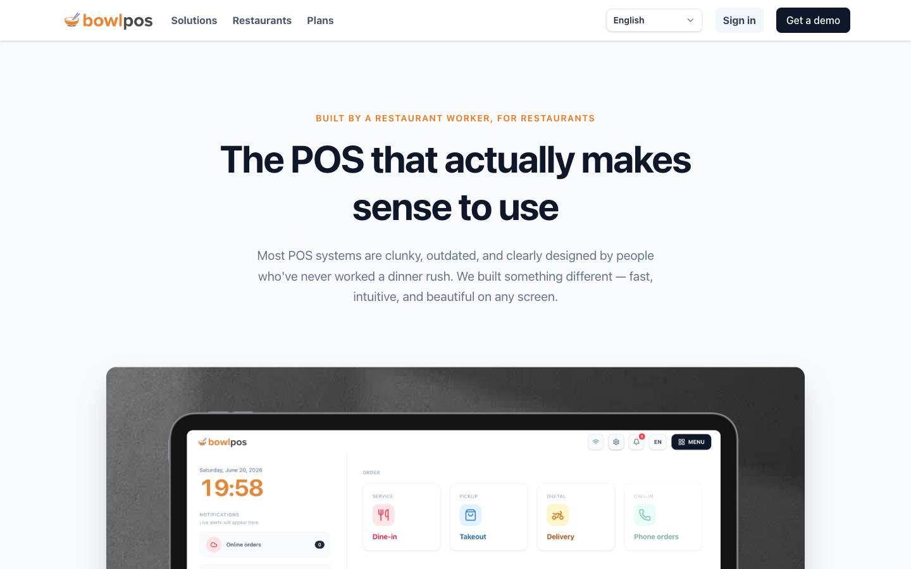
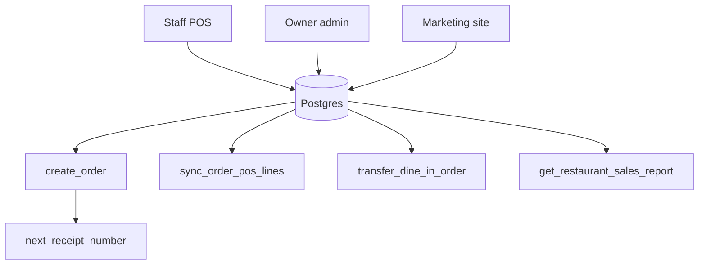

# BowlPOS

Cloud restaurant point of sale. Servers take dine-in, takeaway, delivery, and phone tickets on a tablet or a browser. The kitchen sees the same ticket. Three restaurants run it, about 200–300 orders a day, with peaks near 900.

Source stays private. Demo on request.

- Marketing: [bowlpos.com](https://bowlpos.com)
- Staff POS: [pos.bowlpos.com](https://pos.bowlpos.com)
- Owner admin: [admin.bowlpos.com](https://admin.bowlpos.com)

| Staff POS | Owner admin |
|---|---|
|  |  |

The signed-in floor and the live dashboard are not shown here. Those screens hold restaurant tickets.

## What it does

No custom hardware. iPad, Android, or a desktop browser. The ticket lives in shared Postgres, so every station is looking at the same order. The floor needs internet.

Staff POS covers the floor, takeaway, delivery, phone orders, checkout, and the kitchen. Owner admin covers the menu, modifiers, customers, orders, analytics, reports, and settings. Roles are owner, manager, staff, and user. The side nav only shows sections that role can open.

Order status moves `pending` → `confirmed` → `in_progress` → `ready` → `served` → `completed`, and can end as `cancelled` or `refunded`. Payments are cash, card, mobile, or other.

The admin and the marketing site ship in more than one language. The POS sign-in page has a language switcher.

## Architecture

Staff do not insert into `orders` from the browser. `create_order` is `SECURITY DEFINER`. It checks the caller, writes the ticket, and takes the next receipt number from `next_receipt_number`, which locks the sequence row so two terminals cannot mint the same number.

`sync_order_pos_lines` updates an open check and skips lines the kitchen already started. `transfer_dine_in_order` moves a dine-in check between tables when the destination is available or reserved. `get_restaurant_sales_report` aggregates in Postgres instead of pulling every ticket into the browser.

Row-level security scopes queries to the signed-in restaurant. Menus, categories, items, and modifier groups are restaurant-scoped. Line prices are copied onto the ticket when the order is created, so a later menu edit does not rewrite last night's check.

An Electron shell can load the hosted POS. The order rows still live in Postgres, not on the PC.

## Stack

TanStack Start, React, Supabase Postgres, TanStack Query, Tailwind. The admin shell is a side nav plus a top bar (`AdminShell`). Menu editing is its own section: menus, categories, items, modifier groups.

## License

This note does not include the product source. All rights reserved.
